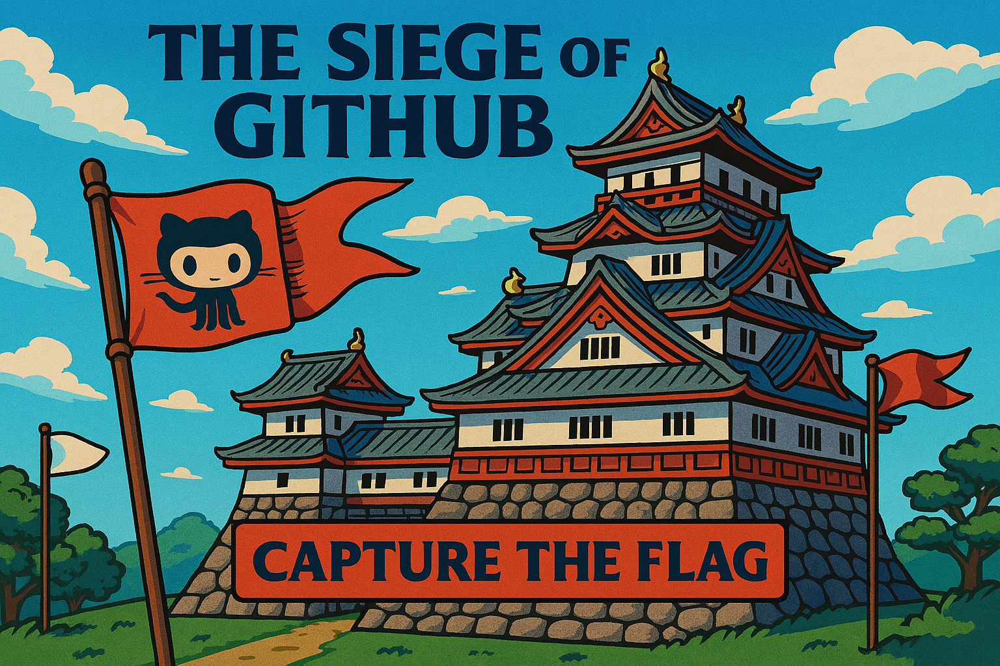

# The Siege of GitHub

This repository holds the working plan for *The Siege of GitHub: Capture The Flag* events.

## 10 Flags, 11 winners

1.	Introduction to GitHub
2.	GitHub Pages
3.	Intro to Repository Management
4.	Customize your GitHub Copilot experience
5.	Integrate MCP with GitHub Copilot
6.	Modernize your legacy code with GitHub Copilot
7.	Scale institutional knowledge with GitHub Copilot Spaces
8.	Build applications with GitHub Copilot agent mode
9.	AI in Actions
10.	Introduction to CodeQL

## Who can participate?

Anyone with interest to learn GitHub! The event is a learning experience, and the flags represent varying levels of skills with GitHub: from absolute beginners, to advance experts!

## How can I participate?

You can sign up by starring this repository.

(Yes, it’s that easy 😊, thanks to the [star](https://docs.github.com/en/webhooks/webhook-events-and-payloads#star) API)

## Can I skip the easy flags?

Absolutely! It’s really up to you. In a CTA event, there’s a prize for the winner that captures each of the flag first. So, you can either play it fast by going through what you’re familiar quickly (and competing with more people) or go for the harder flags that less people will be competing for.
